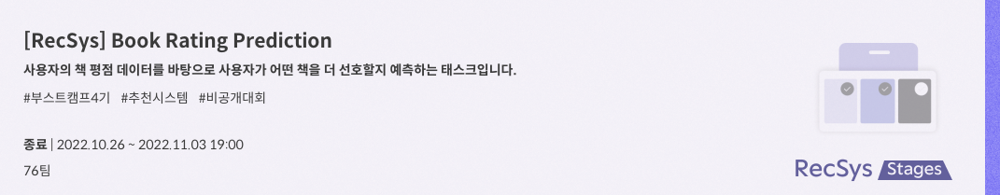
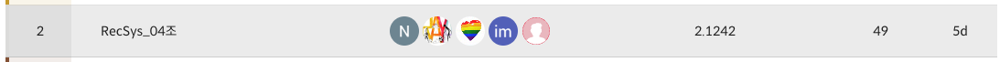
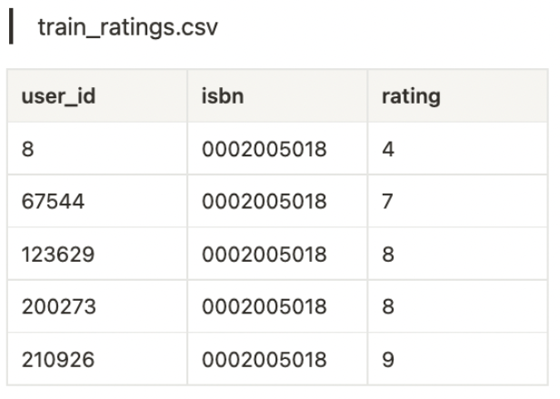
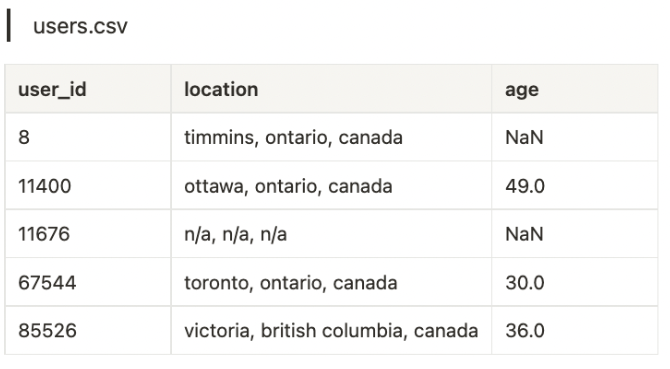
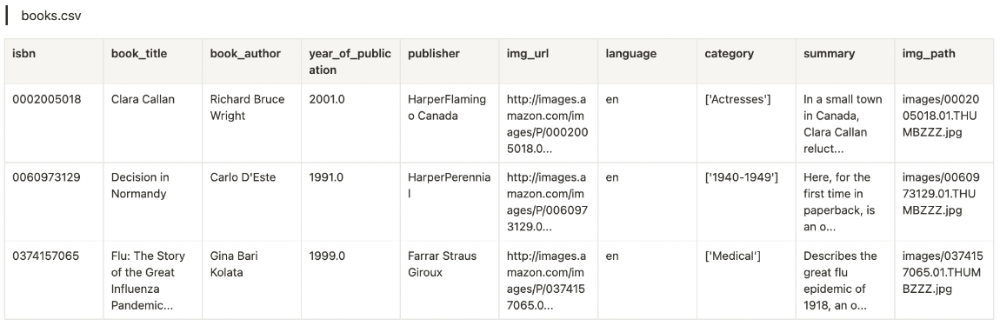
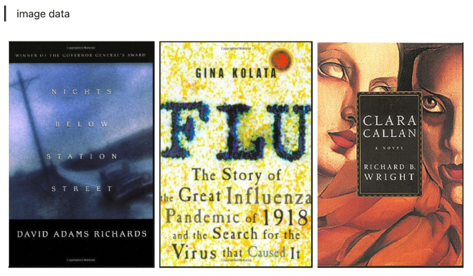

# LEVEL1 P Stage - Book Recommendation

&nbsp; 
### RecSys_4조

&nbsp; 

### 🥈 최종 결과 



&nbsp; 
&nbsp; 
&nbsp; 
## 🙋🏻‍♂️🙋🏻‍♀️  Member
<table>
  <tr height="125px">
    <td align="center" width="120px">
      <a href="https://github.com/NooKo92"></a>
    </td>
    <td align="center" width="120px">
      <a href="https://github.com/Zerotay"></a>
    </td>
    <td align="center" width="120px">
      <a href="https://github.com/NIckmin96"></a>
    </td>
    <td align="center" width="120px">
      <a href="https://github.com/yhw991228"></a>
    </td>
  </tr>
  <tr height="70px">
    <td align=s"center" width="120px">
      <a href="https://github.com/NooKo92">고현욱_T4007</a>
    </td>
    <td align="center" width="120px">
      <a href="https://github.com/Zerotay">김동건_4026</a>
    </td>
    <td align="center" width="120px">
      <a href="https://github.com/NIckmin96">민복기_T4074</a>
    </td>
    <td align="center" width="120px">
      <a href="https://github.com/yhw991228">용희원_T4130</a>
    </td>
  </tr>
</table>
&nbsp; 

## Project Overview

일반적으로 책 한 권은 원고지 기준 800~1000매 정도 되는 분량을 가지고 있습니다.

뉴스기사나 짧은 러닝 타임의 동영상처럼 간결하게 콘텐츠를 즐길 수 있는 ‘숏폼 콘텐츠’는 소비자들이 부담 없이 쉽게 선택할 수 있지만, 책 한권을 모두 읽기 위해서는 보다 긴 물리적인 시간이 필요합니다. 또한 소비자 입장에서는 제목, 저자, 표지, 카테고리 등 한정된 정보로 각자가 콘텐츠를 유추하고 구매 유무를 결정해야 하기 때문에 상대적으로 선택에 더욱 신중을 가하게 됩니다.

해당 경진대회는 이러한 소비자들의 책 구매 결정에 대한 도움을 주기 위한 개인화된 상품 추천 대회입니다.

책과 관련된 정보와 소비자의 정보, 그리고 소비자가 실제로 부여한 평점, 총 3가지의 데이터 셋(users.csv, books.csv, train_ratings.csv)을 활용하여 이번 대회에서는 각 사용자가 주어진 책에 대해 얼마나 평점을 부여할지에 대해 예측하게 됩니다.

&nbsp; 

## 🗂️ Dataset

#### Input
- ```training_rating.csv``` : 각 사용자가 책에 대해 평점을 매긴 내역

- ```users.csv``` : 사용자에 대한 정보

- ```books.csv``` : 책에 대한 정보

- ```Image/``` : 책 이미지


